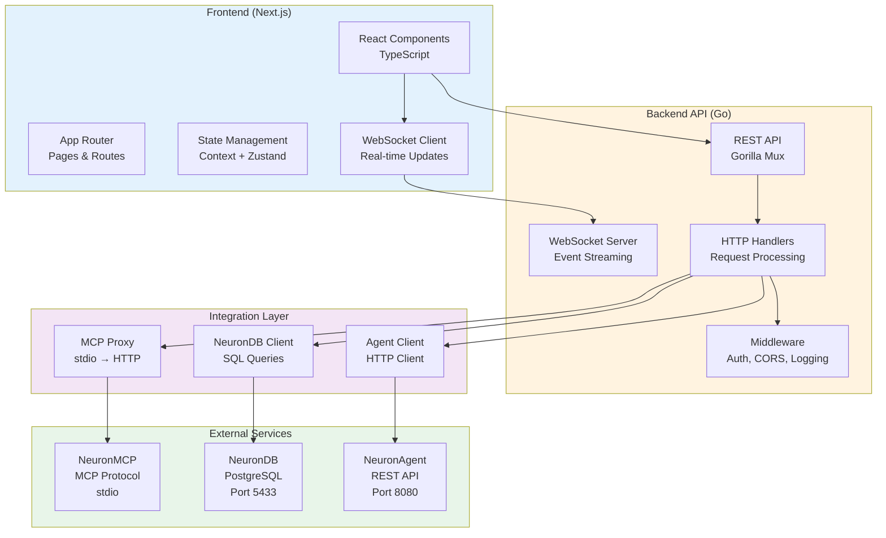
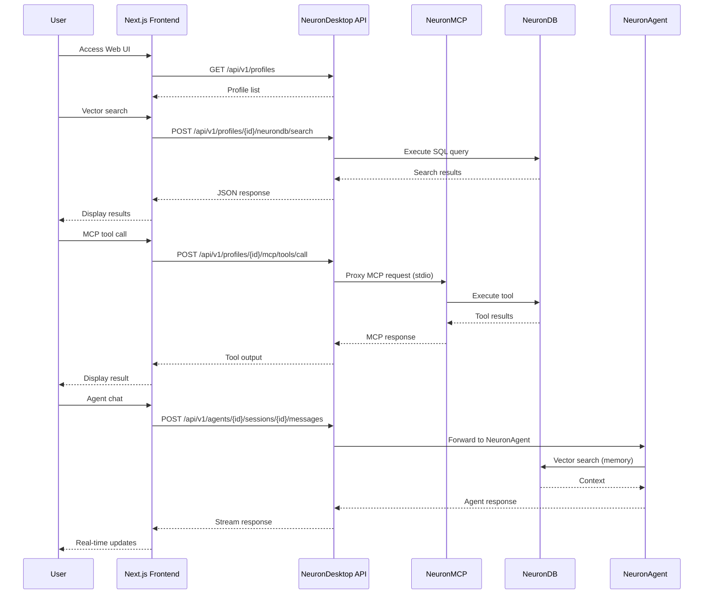
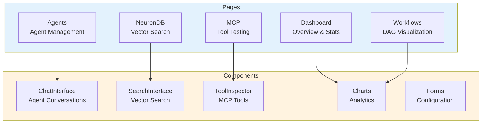

# NeuronDesktop

<div align="center">

**Unified web interface for MCP servers, NeuronDB, and NeuronAgent**

[](https://nextjs.org/)
[](https://golang.org/)
[](https://www.typescriptlang.org/)
[](https://github.com/neurondb/neurondb)
[](../LICENSE)
[](https://www.neurondb.ai/docs/neurondesktop)

</div>

NeuronDesktop is a full-featured web application that provides a unified interface for managing and interacting with:
- **MCP Servers** - Model Context Protocol servers with tool inspection and testing
- **NeuronDB** - Vector database with semantic search and collection management
- **NeuronAgent** - AI agent runtime with session management

## Documentation

- **[Features](docs/features.md)** - Complete feature list and capabilities
- **[API Reference](docs/API.md)** - Complete REST API documentation
- **[Integration Guide](docs/INTEGRATION.md)** - Integration with NeuronMCP and NeuronAgent
- **[NeuronAgent Usage](docs/NEURONAGENT_USAGE.md)** - How to use NeuronAgent in NeuronDesktop
- **[NeuronMCP Setup](docs/NEURONMCP_SETUP.md)** - NeuronMCP setup and configuration
- **[Deployment](docs/DEPLOYMENT.md)** - Deployment and configuration

## Features

### 🎯 Core Features

- **Unified Interface** - Single dashboard for all NeuronDB ecosystem components
- **Real-time Communication** - WebSocket support for live updates
- **Markdown Rendering** - Beautiful formatting for AI responses with syntax highlighting
- **Secure Authentication** - API key-based authentication with rate limiting
- **Professional UI** - Modern, responsive design with smooth animations
- **Comprehensive Logging** - Request/response logging with detailed analytics
- **Metrics & Monitoring** - Built-in metrics collection and health checks

### 🔧 Technical Features

- **Modular Architecture** - Clean separation of concerns, easy to extend
- **Operational readiness** - Error handling, graceful shutdown, connection pooling
- **Docker Support** - Complete Docker Compose setup for easy deployment
- **Type Safety** - Full TypeScript frontend, strongly-typed Go backend
- **Validation** - Comprehensive input validation and SQL injection protection
- **Rate Limiting** - Configurable rate limits per API key

## Architecture

### System Architecture



### Request Flow



### UI Component Structure



## 📑 Table of Contents

<details>
<summary><strong>Expand full table of contents</strong></summary>

- [Overview](#overview)
- [Documentation](#documentation)
- [Features](#features)
- [Architecture](#architecture)
  - [System Architecture](#system-architecture)
  - [Request Flow](#request-flow)
  - [UI Component Structure](#ui-component-structure)
- [Quick Start](#quick-start)
  - [Automated Setup](#automated-setup-recommended)
  - [Using Docker](#using-docker-recommended)
  - [Native Installation](#native-installation)
- [Project Structure](#project-structure)
- [API Documentation](#api-documentation)
- [Configuration](#configuration)
- [Development](#development)
- [Deployment](#deployment)
- [Security](#security)
- [Contributing](#contributing)
- [License](#license)
- [Support](#support)
- [Roadmap](#roadmap)

</details>

---

## Quick Start

### Automated Setup (Recommended)

<details>
<summary><strong>📋 Setup Checklist</strong></summary>

- [ ] Docker and Docker Compose installed
- [ ] Ports 3000, 8081 available
- [ ] NeuronDB running (port 5433)
- [ ] NeuronAgent running (port 8080, optional)
- [ ] NeuronMCP binary available (optional)

</details>

The easiest way to get started is using the automated setup script:

```bash
# Clone the repository
git clone <repository-url>
cd NeuronDesktop

# Set database connection (optional - defaults for Docker Compose shown)
export DB_HOST=localhost
export DB_PORT=5433        # Docker Compose default port
export DB_NAME=neurondesk
export DB_USER=neurondb     # Docker Compose default user
export DB_PASSWORD=neurondb  # Docker Compose default password

# Run automated setup
./scripts/neurondesktop-setup.sh
```

This script will:
1. ✅ Check database connection
2. ✅ Run database migrations
3. ✅ Build NeuronMCP binary (if source available)
4. ✅ Auto-detect NeuronMCP binary location
5. ✅ Create default profile with NeuronMCP configured
6. ✅ Create sample NeuronAgent (if NeuronAgent is running)
7. ✅ Verify setup

**Environment Variables for Setup:**
- `DB_HOST`, `DB_PORT`, `DB_NAME`, `DB_USER`, `DB_PASSWORD` - Database connection
- `NEURONMCP_BINARY_PATH` - Override NeuronMCP binary location
- `NEURONDB_HOST`, `NEURONDB_PORT`, `NEURONDB_DATABASE`, `NEURONDB_USER`, `NEURONDB_PASSWORD` - NeuronDB connection for MCP
- `NEURONAGENT_ENDPOINT` - NeuronAgent API endpoint (default: http://localhost:8080)
- `NEURONAGENT_API_KEY` - NeuronAgent API key (optional)

After setup, start the services:

```bash
# Start API server
cd api && go run cmd/server/main.go

# In another terminal, start frontend
cd frontend && npm run dev

# Access the application
# Frontend: http://localhost:3000
# Backend: http://localhost:8081
```

### Using Docker (Recommended)

NeuronDesktop is integrated into the root-level Docker Compose configuration. From the repository root:

```bash
# Start all services (NeuronDB, NeuronAgent, NeuronMCP, and NeuronDesktop)
docker compose --profile default up -d

# Access the application
# Frontend: http://localhost:3000
# Backend API: http://localhost:8081
```

**Note:** 
- NeuronDesktop automatically uses the existing `neurondb` Postgres container (no separate Postgres needed)
- The `neurondesk` database is automatically created and initialized on first startup
- The default profile is automatically created on API startup
- To configure NeuronMCP, set the environment variables in the root `docker-compose.yml` or run the setup script before starting containers

**Standalone Docker Setup (Alternative):**

If you need to run NeuronDesktop independently, you can use the standalone `NeuronDesktop/docker-compose.yml`:

```bash
cd NeuronDesktop
docker-compose up -d
```

**Note:** The standalone setup uses its own Postgres container on port 5433, which may conflict with the root-level stack if both are running simultaneously.

#### Running as a Service

For systemd (Linux) or launchd (macOS), see [Service Management Guide](../../Docs/getting-started/installation-services.md).

### Native Installation

#### Automated Installation (Recommended)

Use the installation script for easy setup:

```bash
# From repository root
sudo ./scripts/install-neurondesktop.sh

# With system service enabled
sudo ./scripts/install-neurondesktop.sh --enable-service
```

**Note:** The installation script installs the API backend. For the frontend, see [Frontend Setup](#frontend-setup) below.

#### Manual Setup

##### Backend

```bash
cd api

# Set environment variables (Docker Compose defaults)
export DB_HOST=localhost
export DB_PORT=5433        # Docker Compose default port
export DB_USER=neurondb     # Docker Compose default user
export DB_PASSWORD=neurondb  # Docker Compose default password
export DB_NAME=neurondesk

# Initialize database
createdb neurondesk
psql -d neurondesk -f migrations/001_initial_schema.sql

# Run server
go run cmd/server/main.go
```

Or use the setup script:

```bash
cd NeuronDesktop
./scripts/neurondesktop-setup.sh
cd api
go run cmd/server/main.go
```

##### Frontend

```bash
cd frontend

# Install dependencies
npm install

# Run development server
npm run dev
```

## Project Structure

```
NeuronDesktop/
├── api/                      # Go backend
│   ├── cmd/server/          # Server entrypoint
│   ├── internal/
│   │   ├── mcp/             # MCP proxy client
│   │   ├── neurondb/        # NeuronDB Postgres client
│   │   ├── agent/           # NeuronAgent HTTP client
│   │   ├── auth/            # Authentication
│   │   ├── config/          # Configuration
│   │   ├── db/              # Database layer
│   │   ├── handlers/        # HTTP handlers
│   │   ├── logging/         # Logging
│   │   ├── middleware/      # HTTP middleware
│   │   ├── metrics/         # Metrics collection
│   │   └── utils/           # Utilities
│   ├── migrations/          # Database migrations
│   └── Dockerfile           # Docker image
├── frontend/                # Next.js frontend
│   ├── app/                # Next.js app router
│   ├── components/         # React components
│   ├── lib/                # Utilities and API clients
│   └── Dockerfile          # Docker image
├── docs/                   # Documentation
│   ├── API.md             # API documentation
│   └── deployment.md      # Deployment guide
└── docker-compose.yml      # Docker Compose configuration
```

## API Documentation

See [docs/API.md](docs/API.md) for complete API documentation.

### Key Endpoints

- `GET /health` - Health check
- `GET /api/v1/profiles` - List profiles
- `GET /api/v1/profiles/{id}/mcp/tools` - List MCP tools
- `POST /api/v1/profiles/{id}/neurondb/search` - Vector search
- `GET /api/v1/metrics` - Application metrics

## Configuration

### Default Profile

NeuronDesktop automatically creates a default profile on first startup with:
- **NeuronMCP Integration**: Auto-detected and configured
- **NeuronDB Connection**: Configured via environment variables
- **NeuronAgent Integration**: Optional, configured if endpoint is provided

The default profile is marked as `is_default = true` and is used when no specific profile is selected.

### Sample NeuronAgent

If NeuronAgent is running and accessible, the setup script will create a sample agent:
- **Name**: `sample-assistant`
- **Description**: General purpose assistant for answering questions and helping with tasks
- **Model**: `gpt-4` (configurable)
- **Tools**: `sql`, `http`
- **Config**: temperature: 0.7, max_tokens: 1000

You can customize the sample agent by setting:
- `SAMPLE_AGENT_NAME` - Agent name
- `SAMPLE_AGENT_MODEL` - Model to use
- `SAMPLE_AGENT_TOOLS` - Comma-separated list of tools

### Environment Variables

**Backend:**
- `DB_HOST`, `DB_PORT`, `DB_USER`, `DB_PASSWORD`, `DB_NAME` - Database connection
- `SERVER_PORT` - Server port (default: 8081)
- `LOG_LEVEL` - Log level (debug, info, warn, error)
- `CORS_ALLOWED_ORIGINS` - CORS origins (comma-separated)
- `NEURONMCP_BINARY_PATH` - Override NeuronMCP binary location
- `NEURONDB_HOST`, `NEURONDB_PORT`, `NEURONDB_DATABASE`, `NEURONDB_USER`, `NEURONDB_PASSWORD` - NeuronDB connection for MCP
- `NEURONAGENT_ENDPOINT` - NeuronAgent API endpoint
- `NEURONAGENT_API_KEY` - NeuronAgent API key

**Frontend:**
- `NEXT_PUBLIC_API_URL` - Backend API URL

## Development

### Backend Development

```bash
cd api
go mod download
go run cmd/server/main.go
```

### Frontend Development

```bash
cd frontend
npm install
npm run dev
```

### Running Tests

```bash
# Backend tests
cd api
go test ./...

# Frontend tests (when added)
cd frontend
npm test
```

## Deployment

See [docs/deployment.md](docs/deployment.md) for detailed deployment instructions.

### Deployment checklist

- [ ] Set strong database passwords
- [ ] Configure CORS allowed origins
- [ ] Enable HTTPS
- [ ] Set up monitoring and alerts
- [ ] Configure backup strategy
- [ ] Review rate limits
- [ ] Set up log aggregation

## Security

- API key authentication required for all endpoints
- Rate limiting per API key
- SQL injection protection
- Input validation on all requests
- CORS configuration
- Secure password hashing (bcrypt)

## Contributing

1. Fork the repository
2. Create a feature branch
3. Make your changes
4. Add tests
5. Submit a pull request

## License

See [LICENSE](../LICENSE) file for license information.

## Support

- **Documentation**: See `docs/` directory
- **Issues**: Report issues on GitHub
- **Email**: support@neurondb.ai

## Roadmap

- [ ] Multi-user support with organizations
- [ ] Advanced query builder for NeuronDB
- [ ] Real-time collaboration features
- [ ] Plugin system for custom integrations
- [ ] Advanced analytics dashboard
- [ ] Export/import functionality
- [ ] API documentation explorer
- [ ] Webhook support

---

<div align="center">

[⬆ Back to Top](#neurondesktop)

</div>
