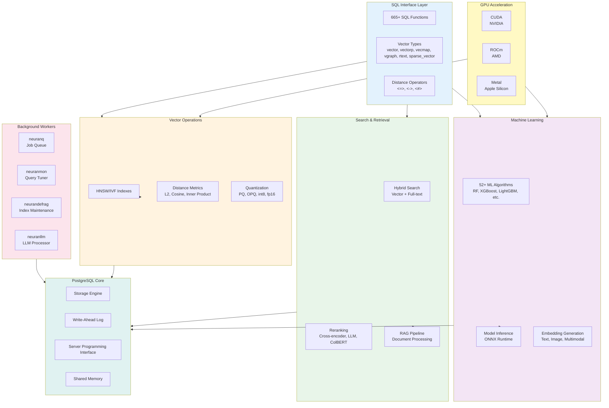
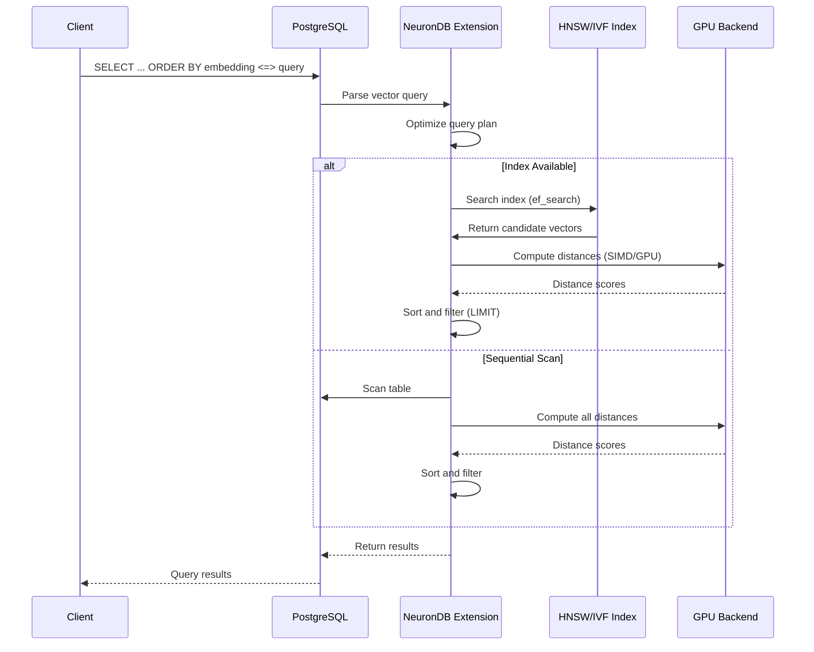
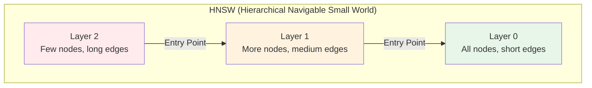

# NeuronDB - AI Database Extension for PostgreSQL

**Vector search, machine learning, and hybrid search directly in PostgreSQL**

---

## 📑 Table of Contents

<strong>Expand full table of contents</strong>

- [Overview](#overview)
  - [Key Capabilities](#key-capabilities)
  - [Performance Metrics](#performance-metrics)
- [Documentation](#documentation)
  - [Getting Started](#getting-started)
  - [Vector Search & Indexing](#vector-search--indexing)
  - [ML Algorithms & Analytics](#ml-algorithms--analytics)
  - [ML & Embeddings](#ml--embeddings)
  - [Hybrid Search & Retrieval](#hybrid-search--retrieval)
  - [Reranking](#reranking)
  - [RAG Pipeline](#rag-pipeline)
  - [Background Workers](#background-workers)
  - [GPU Acceleration](#gpu-acceleration)
  - [Performance & Security](#performance--security)
  - [Configuration & Operations](#configuration--operations)
- [Official Documentation](#official-documentation)
- [Architecture](#architecture)
  - [System Architecture](#system-architecture)
  - [Vector Query Flow](#vector-query-flow)
  - [HNSW Index Structure](#hnsw-index-structure)
- [Compatibility](#compatibility)
- [Support & Community](#support--community)
- [Contributing](#contributing)
- [License](#license)
- [Authors](#authors)

---

## Overview

NeuronDB extends PostgreSQL with vector search, ML model inference, hybrid retrieval, and RAG pipeline support.

### Key Capabilities

<strong>📊 Feature Summary</strong>

| Category | Features | Count |
|:---------|:---------|:-----|
| **Vector Types** | `vector`, `vectorp`, `vecmap`, `vgraph`, `rtext`, `sparse_vector` | 6 types |
| **Index Types** | HNSW, IVF, PQ, OPQ, hybrid, multi-vector | 6+ types |
| **Distance Metrics** | L2, Cosine, Inner Product, Hamming, Jaccard, etc. | 7+ metrics |
| **ML Algorithms** | Random Forest, XGBoost, LightGBM, K-Means, PCA, etc. | 52+ algorithms |
| **SQL Functions** | Vector ops, ML inference, embeddings, RAG, etc. | 665+ functions |
| **GPU Backends** | CUDA, ROCm, Metal | 3 backends |
| **Background Workers** | neuranq, neuranmon, neurandefrag, neuranllm | 4 workers |

### Performance Metrics

NeuronDB provides significant performance improvements over standard PostgreSQL extensions:

**Index Build Performance:**

The index build time for HNSW follows the relationship:

$$T_{build} = O(N \cdot \log N \cdot m \cdot ef_{construction})$$

Where:
- $N$ = number of vectors
- $m$ = number of connections per node (typically 16-32)
- $ef_{construction}$ = size of candidate list during construction (typically 64-200)

**Query Performance:**

Query latency for HNSW search:

$$T_{query} = O(\log N + ef_{search} \cdot k)$$

Where:
- $ef_{search}$ = size of candidate list during search (typically 40-200)
- $k$ = number of results requested

**Throughput Calculation:**

$$QPS = \frac{1}{T_{query}} = \frac{1}{O(\log N + ef_{search} \cdot k)}$$

> [!TIP]
> For optimal performance, tune `ef_search` based on your recall requirements. Higher values improve recall but increase latency.

## Documentation

### Getting Started
- **[Installation](docs/getting-started/installation.md)** - Install NeuronDB extension
- **[Extension packaging](EXTENSION.md)** - Control file, file layout, CREATE/UPDATE/DROP EXTENSION, dump/restore
- **[Quick Start](docs/getting-started/quickstart.md)** - Get up and running quickly

### Vector Search & Indexing
- **[Vector Types](docs/vector-search/vector-types.md)** - `vector`, `vectorp`, `vecmap`, `vgraph`, `rtext`, `sparse_vector` types
- **[Indexing](docs/vector-search/indexing.md)** - HNSW and IVF indexing
- **[Distance Metrics](docs/vector-search/distance-metrics.md)** - L2, Cosine, Inner Product, and more
- **[Quantization](docs/vector-search/quantization.md)** - PQ and OPQ compression

### ML Algorithms & Analytics
- **[Random Forest](docs/ml-algorithms/random-forest.md)** - Classification and regression
- **[Gradient Boosting](docs/ml-algorithms/gradient-boosting.md)** - XGBoost, LightGBM, CatBoost
- **[Clustering](docs/ml-algorithms/clustering.md)** - K-Means, DBSCAN, GMM, Hierarchical
- **[Dimensionality Reduction](docs/ml-algorithms/dimensionality-reduction.md)** - PCA and PCA Whitening
- **[Classification](docs/ml-algorithms/classification.md)** - SVM, Logistic Regression, Naive Bayes, Decision Trees
- **[Regression](docs/ml-algorithms/regression.md)** - Linear, Ridge, Lasso, Deep Learning
- **[Outlier Detection](docs/ml-algorithms/outlier-detection.md)** - Z-score, Modified Z-score, IQR
- **[Quality Metrics](docs/ml-algorithms/quality-metrics.md)** - Recall@K, Precision@K, F1@K, MRR
- **[Drift Detection](docs/ml-algorithms/drift-detection.md)** - Centroid drift, Distribution divergence
- **[Topic Discovery](docs/ml-algorithms/topic-discovery.md)** - Topic modeling and analysis
- **[Time Series](docs/ml-algorithms/time-series.md)** - Forecasting and analysis
- **[Recommendation Systems](docs/ml-algorithms/recommendation-systems.md)** - Collaborative filtering

### ML & Embeddings
- **[Embedding Generation](docs/ml-embeddings/embedding-generation.md)** - Text, image, multimodal embeddings
- **[Model Inference](docs/ml-embeddings/model-inference.md)** - ONNX runtime, batch processing
- **[Model Management](docs/ml-embeddings/model-management.md)** - Load, export, version models
- **[AutoML](docs/ml-embeddings/automl.md)** - Automated hyperparameter tuning
- **[Feature Store](docs/ml-embeddings/feature-store.md)** - Feature management and versioning

### Hybrid Search & Retrieval
- **[Hybrid Search](docs/hybrid-search/overview.md)** - Combine vector and full-text search
- **[Multi-Vector](docs/hybrid-search/multi-vector.md)** - Multiple embeddings per document
- **[Faceted Search](docs/hybrid-search/faceted-search.md)** - Category-aware retrieval
- **[Temporal Search](docs/hybrid-search/temporal-search.md)** - Time-decay relevance scoring

### Reranking
- **[Cross-Encoder](docs/reranking/cross-encoder.md)** - Neural reranking models
- **[LLM Reranking](docs/reranking/llm-reranking.md)** - GPT/Claude-powered scoring
- **[ColBERT](docs/reranking/colbert.md)** - Late interaction models
- **[Ensemble](docs/reranking/ensemble.md)** - Combine multiple strategies

### RAG Pipeline
- **[Complete RAG Support](docs/rag/overview.md)** - End-to-end RAG
- **[LLM Integration](docs/rag/llm-integration.md)** - Hugging Face and OpenAI
- **[Document Processing](docs/rag/document-processing.md)** - Text processing and NLP

### Background Workers
- **[neuranq](docs/background-workers/neuranq.md)** - Async job queue executor
- **[neuranmon](docs/background-workers/neuranmon.md)** - Live query auto-tuner
- **[neurandefrag](docs/background-workers/neurandefrag.md)** - Index maintenance
- **[neuranllm](docs/background-workers/neuranllm.md)** - LLM job processor

### GPU Acceleration
- **[CUDA Support](docs/gpu/cuda-support.md)** - NVIDIA GPU acceleration
- **[ROCm Support](docs/gpu/rocm-support.md)** - AMD GPU acceleration
- **[Metal Support](docs/gpu/metal-support.md)** - Apple Silicon GPU acceleration
- **[Auto-Detection](docs/gpu/auto-detection.md)** - Automatic GPU detection

### Performance & Security
- **[SIMD Optimization](docs/performance/simd-optimization.md)** - AVX2/AVX512, NEON optimization
- **[Security](docs/security/overview.md)** - Encryption, privacy, RLS
- **[Monitoring](docs/performance/monitoring.md)** - Monitoring views and Prometheus

### Configuration & Operations
- **[Configuration](docs/configuration.md)** - Essential configuration options
- **[Troubleshooting](docs/troubleshooting.md)** - Common issues and solutions

## Official Documentation

**For comprehensive documentation, detailed tutorials, complete API references, best practices, and production guides, visit:**

🌐 **[https://www.neurondb.ai/docs](https://www.neurondb.ai/docs)**

The official documentation site provides:
- **Complete API Reference**: All 665+ SQL functions with examples
- **Detailed Tutorials**: Step-by-step guides for all features
- **Performance Guides**: Optimization strategies and benchmarks
- **Production Best Practices**: Deployment, scaling, and monitoring
- **Troubleshooting**: Common issues and solutions
- **Latest Updates**: Release notes and what's new

### Quick Links to Official Documentation

| Topic | Link |
|-------|------|
| Getting Started | [Quick Start Guide](https://www.neurondb.ai/docs/getting-started) |
| Vector Search | [Vector Search Documentation](https://www.neurondb.ai/docs/vector-search) |
| ML Algorithms | [ML Algorithms Guide](https://www.neurondb.ai/docs/ml-algorithms) |
| RAG Pipeline | [RAG Documentation](https://www.neurondb.ai/docs/rag) |
| GPU Acceleration | [GPU Support Guide](https://www.neurondb.ai/docs/gpu) |
| Hybrid Search | [Hybrid Search Guide](https://www.neurondb.ai/docs/hybrid-search) |
| Performance | [Performance Optimization](https://www.neurondb.ai/docs/performance) |
| Security | [Security Features](https://www.neurondb.ai/docs/security) |
| API Reference | [Complete API Reference](https://www.neurondb.ai/docs/api) |

## Architecture

NeuronDB follows PostgreSQL's architectural patterns and extends the database with AI capabilities.

### System Architecture

### Vector Query Flow

### HNSW Index Structure

> [!NOTE]
> HNSW creates a multi-layer graph where higher layers have fewer nodes and longer edges, enabling fast approximate nearest neighbor search. The search starts at the top layer and navigates down to find the closest neighbors.

## Compatibility

<strong>📋 Compatibility Matrix</strong>

| PostgreSQL | Status | Platforms | Architectures |
|:----------|:-------|:----------|:--------------|
| 16.x | ✅ Supported | Ubuntu 20.04/22.04, Debian 11/12, Rocky Linux 8/9, macOS 13+ | linux/amd64, linux/arm64, darwin/arm64 |
| 17.x | ✅ Supported | Ubuntu 20.04/22.04, Debian 11/12, Rocky Linux 8/9, macOS 13+ | linux/amd64, linux/arm64, darwin/arm64 |
| 18.x | ✅ Supported | Ubuntu 20.04/22.04, Debian 11/12, Rocky Linux 8/9, macOS 13+ | linux/amd64, linux/arm64, darwin/arm64 |

> [!NOTE]
> NeuronDB supports PostgreSQL 16, 17, and 18. The extension validates the PostgreSQL version at creation time. GPU acceleration requires platform-specific drivers (CUDA 12.2+, ROCm 5.7+, or macOS 13+ for Metal).

## Support & Community

<strong>📞 Get Help</strong>

| Resource | Link | Description |
|:---------|:-----|:------------|
| **GitHub Issues** | [Report Issues](https://github.com/neurondb/NeurondB/issues) | Bug reports and feature requests |
| **GitHub Discussions** | [Join Discussion](https://github.com/neurondb/NeurondB/discussions) | Community Q&A and discussions |
| **Email Support** | support@neurondb.ai | Direct email support |
| **Security Issues** | security@neurondb.ai | Report security vulnerabilities |
| **Documentation** | [neurondb.ai/docs](https://www.neurondb.ai/docs) | Complete documentation |

## Contributing

We welcome contributions! Please see [CONTRIBUTING.md](../CONTRIBUTING.md) for:

<strong>📝 Contribution Guidelines</strong>

- ✅ **Code style guidelines** - Follow PostgreSQL coding standards
- ✅ **Development workflow** - Fork, branch, test, submit PR
- ✅ **Testing requirements** - All changes must include tests
- ✅ **Pull request process** - Review and approval workflow
- ✅ **Documentation** - Update docs for new features

## License

NeuronDB is released under a proprietary license. See [LICENSE](../LICENSE) for details.

<strong>📄 License Summary</strong>

| Usage Type | Permitted | Notes |
|:-----------|:----------|:------|
| **Personal Use** | ✅ Yes | Binary code only |
| **Commercial Use** | ❌ No | Contact for licensing |
| **Source Modifications** | ❌ No | No derivatives allowed |
| **Redistribution** | ❌ No | Contact for distribution rights |

**For commercial licensing**, contact support@neurondb.ai

## Authors

**neurondb, Inc.**  
Email: support@neurondb.ai  
Website: https://neurondb.ai/docs

---

**[Documentation](docs/)** • 
**[Full Documentation](https://neurondb.ai/docs)** • 
**[GitHub](https://github.com/neurondb/NeurondB)** • 
**[Support](mailto:support@neurondb.ai)**

[⬆ Back to Top](#neurondb---ai-database-extension-for-postgresql)

