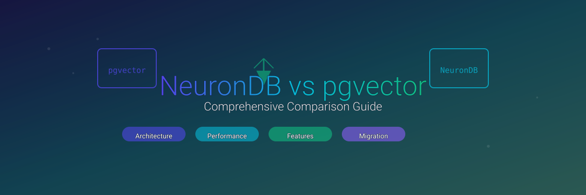

# NeuronDB Vector vs pgvector: Comprehensive Comparison

**[View on GitHub](https://github.com/neurondb-ai/neurondb)** | **[Download Latest Release](https://github.com/neurondb-ai/neurondb/releases)** | **[Documentation](https://neurondb.ai/docs)**

Vector similarity search powers modern AI applications. Semantic search uses vectors. Recommendation systems use vectors. RAG pipelines use vectors. Image search uses vectors. PostgreSQL extensions add vector capabilities directly to the database. You avoid separate vector database infrastructure.

Two solutions exist. pgvector is the industry standard. NeuronDB is an enhanced alternative. This comparison examines both extensions. We cover architecture, features, performance, and use cases. You learn when to choose each solution.

## Introduction

Vector databases store high-dimensional vectors. These vectors represent embeddings from machine learning models. Vectors capture semantic meaning. Similarity search finds related content based on conceptual relationships. Exact text matching is not required.

Applications include semantic search engines. Applications include recommendation systems. Applications include RAG pipelines. Applications include image similarity search.

PostgreSQL extensions add vector types. Extensions add distance operators. Extensions add indexing methods. Extensions maintain full compatibility with PostgreSQL transactions. Extensions work with backup systems. Extensions integrate with the query planner. This approach eliminates data synchronization overhead. Unified queries combine vector similarity with relational filters.

pgvector was the first widely-adopted PostgreSQL vector extension. It established the standard for vector operations in PostgreSQL. It provides essential vector types. It provides distance operators. It provides HNSW and IVFFlat indexing. The extension focuses on core vector functionality. It uses a minimal API. It integrates with PostgreSQL.

NeuronDB extends PostgreSQL with AI capabilities. It maintains full pgvector compatibility. It adds enhancements. Beyond vector operations, NeuronDB adds GPU acceleration. It adds additional vector types. It adds quantization techniques. It adds ML algorithms. It adds embedding generation. It adds RAG pipeline support. The extension maintains 100 percent compatibility with pgvector syntax. It provides advanced features for production AI applications.

This comparison examines both extensions. We cover architectural implementation. We cover feature completeness. We cover performance characteristics. We cover practical use cases. We provide analysis to help you choose the right solution.

## Architecture Deep Dive

Architectural differences reveal design philosophies. Both extensions integrate with PostgreSQL's type system. Both integrate with the query planner. They differ in scope. They differ in optimization strategies. They differ in feature sets.

### pgvector Architecture

pgvector implements a focused vector extension. It is designed for core vector operations. The extension follows PostgreSQL's extension architecture. It implements custom types in pure C code. It implements operators in pure C code. It implements index access methods in pure C code.

Type System:
pgvector defines a single primary vector type. The type stores as a varlena structure. The type uses PostgreSQL's flexible array member pattern. It stores dimension count. It stores floating-point data in contiguous memory. Binary I/O functions enable efficient serialization. Serialization works for network transfers. Serialization works for disk storage.

Storage Format:
Vectors store as varlena structures. The header contains dimension information. The header is followed by an array of single-precision floating-point values. The format supports fixed-dimension constraints through PostgreSQL's typmod system. Dimension validation occurs at the type level. Storage uses PostgreSQL's TOAST for large vectors. TOAST automatically compresses vectors exceeding page size limits.

Index Structures:
pgvector implements two index access methods. HNSW builds a multi-layer graph structure. It is optimized for approximate nearest neighbor search. It provides logarithmic query time complexity. IVFFlat partitions vectors into clusters using k-means. It stores vectors in inverted lists associated with cluster centroids. Both index types integrate with PostgreSQL's query planner. They enable index-only scans for vector similarity queries.

Query Execution:
Distance operators integrate with PostgreSQL's operator class system. The query planner selects appropriate indexes based on operator usage. The planner recognizes ORDER BY clauses with distance operators. It generates index scan plans when suitable indexes exist. Filtered queries combine vector similarity with relational WHERE clauses. The planner needs hints for optimal index selection in complex queries.

Example Query:
```sql
-- Basic similarity search with pgvector
SELECT id, content, embedding <-> '[0.1,0.2,0.3]'::vector AS distance
FROM documents
ORDER BY embedding <-> '[0.1,0.2,0.3]'::vector
LIMIT 10;

-- Filtered search
SELECT id, content, embedding <-> query_vector AS distance
FROM documents
WHERE category = 'technology'
ORDER BY embedding <-> query_vector
LIMIT 10;
```

Limitations:
pgvector focuses exclusively on vector operations. It provides no GPU acceleration. It provides no embedding generation. It provides no ML algorithm integration. Index tuning requires manual parameter adjustment. Query-time parameters like ef_search for HNSW must be set via session variables. They are not index options. The extension does not include background workers for maintenance. It does not include automatic optimization. Manual intervention is required for index management. Manual intervention is required for performance tuning.

Performance Characteristics:
pgvector provides solid performance for standard vector operations. HNSW indexes deliver sub-10ms query latency. This works for datasets up to 100 million vectors. The implementation uses standard C code. It does not use SIMD optimizations. It relies on PostgreSQL's query planner. It relies on standard memory management. Performance scales with available CPU cores. It does not leverage GPU acceleration. It does not leverage specialized vector instructions.

### NeuronDB Architecture

NeuronDB implements a comprehensive AI extension. It extends PostgreSQL with vector operations. It extends PostgreSQL with ML algorithms. It extends PostgreSQL with GPU acceleration. It extends PostgreSQL with RAG pipeline support. The architecture builds upon pgvector compatibility. It adds enhancements.

Type System:
NeuronDB implements multiple vector types. Types are optimized for different use cases. The standard vector type maintains full compatibility with pgvector. It uses the same varlena structure. It uses dimension and float4 data. Additional types include vectorp. This is a packed SIMD-optimized format. Additional types include vecmap. This handles sparse high-dimensional vectors. Additional types include vgraph. This handles graph-based vectors. Additional types include rtext. This handles retrieval-optimized text. Quantized types provide compression. halfvec provides FP16 compression at 2x. vectori8 provides INT8 compression at 8x. vectorbinary provides binary compression at 32x. vectorternary provides ternary compression at 16x.

Storage Format:
The core Vector structure matches pgvector's format for compatibility:
```c
typedef struct Vector {
    int32  vl_len_;  // varlena header
    int16  dim;      // number of dimensions
    int16  unused;   // padding for alignment
    float4 data[FLEXIBLE_ARRAY_MEMBER];
} Vector;
```

Additional vector types use specialized storage formats. Formats are optimized for their use cases. Packed vectors include metadata for validation. Metadata includes CRC32 fingerprint. Metadata includes version tag. Metadata includes endianness guard. Sparse vectors store only non-zero values with indices. This enables efficient storage for high-dimensional sparse data.

Index Structures:
NeuronDB implements HNSW and IVF indexes with enhanced capabilities. The HNSW implementation includes SIMD-optimized distance calculations. It includes GPU acceleration support. IVF indexes support all three operator classes. These are L2, cosine, and inner product. Query planning is improved. Background workers provide automatic index maintenance. Background workers provide parameter tuning. Background workers provide defragmentation. Index creation supports helper functions for simplified syntax. It maintains full SQL compatibility.

GPU Acceleration Architecture:
NeuronDB includes optional GPU acceleration. It supports CUDA for NVIDIA. It supports ROCm for AMD. It supports Metal for Apple Silicon. The GPU backend provides transparent acceleration for distance calculations. It provides acceleration for batch operations. It provides acceleration for index search. The system automatically detects available GPUs. It falls back to CPU when GPU is unavailable. Memory management includes GPU memory pools. Memory management includes zero-copy transfers for efficient data movement.

Query Execution:
Enhanced query planning integrates vector operations with ML functions. It integrates with embedding generation. It integrates with hybrid search. The planner optimizes queries combining vector similarity with full-text search. It optimizes queries with temporal filters. It optimizes queries with faceted search. Background workers handle async operations like embedding generation. Background workers handle index maintenance. This enables non-blocking workflows.

Example Queries:
```sql
-- Basic similarity search (identical to pgvector)
SELECT id, content, embedding <-> '[0.1,0.2,0.3]'::vector AS distance
FROM documents
ORDER BY embedding <-> '[0.1,0.2,0.3]'::vector
LIMIT 10;

-- Hybrid search with full-text
SELECT id, content,
       (embedding <=> query_vector) * 0.6 +
       ts_rank_cd(to_tsvector('english', content), query_ts) * 0.4 AS score
FROM documents
WHERE to_tsvector('english', content) @@ query_ts
ORDER BY score
LIMIT 10;

-- With embedding generation
SELECT id, content, embedding <=> embed_text('machine learning') AS distance
FROM documents
ORDER BY embedding <=> embed_text('machine learning')
LIMIT 10;
```

SIMD Optimizations:
NeuronDB includes SIMD-optimized distance calculations. It uses CPU vector instructions. These include AVX, AVX2, and AVX-512. The implementation automatically detects CPU capabilities. It selects optimal code paths. SIMD provides 2-4x speedup for distance calculations on modern CPUs.

Background Workers:
Four background workers extend PostgreSQL's capabilities. neuranllm handles LLM inference. neuranq handles query optimization. neuranmon handles monitoring. neurandefrag handles index maintenance. These workers enable async operations. They enable automatic tuning. They enable continuous maintenance without blocking user queries.

neuranllm Worker:
Handles asynchronous LLM inference for RAG pipelines. Handles text generation. Processes embedding requests in batches. Manages model loading and unloading. Provides caching for frequently used models. Enables non-blocking embedding generation during high-load periods.

neuranq Worker:
Monitors query performance. Automatically tunes index parameters. Analyzes query patterns. Adjusts ef_search and probes values. Recommends index rebuilds when performance degrades. Provides query optimization suggestions based on workload analysis.

neuranmon Worker:
Collects performance metrics. Monitors system health. Generates alerts for performance issues. Tracks query latency. Tracks throughput. Tracks index utilization. Tracks GPU usage. Provides observability for production deployments.

neurandefrag Worker:
Performs automatic index maintenance. Performs defragmentation. Performs vacuum operations. Performs index optimization. Monitors index health. Performs maintenance during low-activity periods. Ensures optimal index performance over time.

## Feature Comparison Matrix

A detailed feature comparison reveals the scope and capabilities of each extension. NeuronDB maintains full compatibility with pgvector. It adds enhancements.

### Vector Types

pgvector:
- vector: Single-precision floating-point vectors (float32)
- halfvec: Half-precision vectors (float16, 2x compression)
- sparsevec: Sparse vectors (stores only non-zero values)
- bit: Binary vectors (1 bit per dimension)

NeuronDB:
- vector: Full pgvector compatibility (float32)
- vectorp: Packed SIMD-optimized format with metadata
- vecmap: Sparse high-dimensional vectors (up to 1M dimensions)
- vgraph: Graph-based vectors with connectivity information
- rtext: Retrieval-optimized text with token metadata
- halfvec: FP16 quantization (2x compression)
- vectori8: INT8 quantization (8x compression)
- vectoru8: UINT8 quantization (8x compression, unsigned)
- vectorbinary: Binary quantization (32x compression)
- vectorternary: Ternary quantization (16x compression, 2 bits per dimension)
- vectori4: INT4 quantization (16x compression, 4 bits per dimension)

Comparison:
NeuronDB provides more vector types. This enables specialized optimizations for different use cases. Quantization types offer storage savings. This works for applications where approximate similarity is acceptable. Sparse vector support scales to higher dimensions than pgvector's implementation.

### Operators

Both extensions support identical distance operators:

| Operator | Description | pgvector | NeuronDB |
|----------|-------------|----------|----------|
| `<->` | L2 (Euclidean) distance | ✅ | ✅ Full |
| `<=>` | Cosine distance | ✅ | ✅ Full |
| `<#>` | Negative inner product | ✅ | ✅ Full |
| `<+>` | L1 (Manhattan) distance | ✅ | ✅ Enhanced |
| `<~>` | Hamming distance | ✅ | ✅ Enhanced |
| `<%>` | Jaccard distance | ✅ | ✅ Enhanced |
| `=` | Equality | ✅ | ✅ Full |
| `<`, `<=`, `>`, `>=` | Lexicographic comparison | ✅ | ✅ Full |
| `!=`, `<>` | Inequality | ✅ | ✅ Full |

Arithmetic Operators:
Both support vector arithmetic. This includes addition, subtraction, scalar multiplication, and scalar division. NeuronDB includes optimizations for batch operations.

### Functions

Core Functions:

| Function | pgvector | NeuronDB | Notes |
|----------|----------|----------|-------|
| `vector_dims(vector)` | ✅ | ✅ Full | Returns dimension count |
| `l2_norm(vector)` | ✅ | ✅ Full | L2 (Euclidean) norm |
| `vector_norm(vector)` | ❌ | ✅ Enhanced | Alias for `l2_norm` |
| `normalize_l2(vector)` | ✅ | ✅ Full | Normalize to unit length |
| `l2_normalize(vector)` | ❌ | ✅ Enhanced | Compatibility alias |

Distance Functions:

| Function | pgvector | NeuronDB | Notes |
|----------|----------|----------|-------|
| `l2_distance(vector, vector)` | ✅ | ✅ Full | Compatibility alias |
| `cosine_distance(vector, vector)` | ✅ | ✅ Full | Compatibility alias |
| `inner_product(vector, vector)` | ✅ | ✅ Full | Compatibility alias |
| `vector_l2_distance(vector, vector)` | ❌ | ✅ Enhanced | Canonical name |
| `vector_cosine_distance(vector, vector)` | ❌ | ✅ Enhanced | Canonical name |
| `vector_inner_product(vector, vector)` | ❌ | ✅ Enhanced | Canonical name |
| `vector_l1_distance(vector, vector)` | ❌ | ✅ Enhanced | Manhattan distance |
| `vector_hamming_distance(vector, vector)` | ❌ | ✅ Enhanced | Hamming distance |
| `vector_chebyshev_distance(vector, vector)` | ❌ | ✅ Enhanced | Chebyshev distance |
| `vector_minkowski_distance(vector, vector, p)` | ❌ | ✅ Enhanced | Minkowski distance |

Array Conversions:

| Function | pgvector | NeuronDB | Notes |
|----------|----------|----------|-------|
| `vector_to_array(vector)` | ✅ | ✅ Full | Convert to `real[]` |
| `array_to_vector(real[])` | ✅ | ✅ Full | Convert from `real[]` |
| `array_to_vector(double precision[])` | ❌ | ✅ Enhanced | Additional cast support |
| `array_to_vector(integer[])` | ❌ | ✅ Enhanced | Additional cast support |
| `array_to_vector(numeric[])` | ❌ | ✅ Enhanced | Additional cast support |

Subvector Operations:

| Function | pgvector | NeuronDB | Notes |
|----------|----------|----------|-------|
| `subvector(vector, start, count)` | ✅ | ✅ Full | 1-based start, count |
| `vector_slice(vector, start, end)` | ❌ | ✅ Enhanced | 0-based start, exclusive end |

Aggregates:

| Aggregate | pgvector | NeuronDB | Notes |
|-----------|----------|----------|-------|
| `avg(vector)` | ✅ | ✅ Full | Element-wise average |
| `sum(vector)` | ✅ | ✅ Full | Element-wise sum |
| `vector_avg(vector)` | ❌ | ✅ Enhanced | Canonical name |
| `vector_sum(vector)` | ❌ | ✅ Enhanced | Canonical name |

NeuronDB-Only Functions:
NeuronDB provides 520+ SQL functions. These include ML algorithms. There are 52+ algorithms covering clustering, classification, regression, and more. Functions include embedding generation. These are embed_text, embed_image, and embed_audio. Functions include hybrid search functions. Functions include reranking functions. These are Cross-encoder, LLM, and ColBERT. Functions include quality metrics. These are Recall@K, Precision@K, and MRR. Functions include drift detection. Functions include analytics functions.

### Indexing

HNSW Index:

| Feature | pgvector | NeuronDB | Notes |
|---------|----------|----------|-------|
| Access method `hnsw` | ✅ | ✅ Full | `CREATE INDEX USING hnsw` |
| Operator class `vector_l2_ops` | ✅ | ✅ Full | L2 distance indexing |
| Operator class `vector_cosine_ops` | ✅ | ✅ Full | Cosine distance indexing |
| Operator class `vector_ip_ops` | ✅ | ✅ Full | Inner product indexing |
| Index option `m` | ✅ | ✅ Full | Number of bi-directional links (default: 16) |
| Index option `ef_construction` | ✅ | ✅ Full | Search width during construction (default: 64) |
| Query parameter `ef_search` | ✅ | ⚠️ Partial | Via GUC or function parameter, not index option |
| GPU acceleration | ❌ | ✅ Enhanced | GPU-accelerated search |
| SIMD optimization | ❌ | ✅ Enhanced | SIMD-optimized distance calculations |
| Auto-tuning | ❌ | ✅ Enhanced | Background worker for parameter tuning |

IVF Index:

| Feature | pgvector | NeuronDB | Notes |
|---------|----------|----------|-------|
| Access method `ivfflat` | ✅ | ✅ Full | NeuronDB uses `ivf` (same functionality) |
| Access method `ivf` | ❌ | ✅ Enhanced | Canonical name in NeuronDB |
| Operator class `vector_l2_ops` | ✅ | ✅ Full | L2 distance indexing |
| Operator class `vector_cosine_ops` | ✅ | ✅ Full | Cosine distance indexing |
| Operator class `vector_ip_ops` | ✅ | ✅ Full | Inner product indexing |
| Index option `lists` | ✅ | ✅ Full | Number of clusters (default: 100) |
| Query parameter `probes` | ✅ | ⚠️ Partial | Via GUC or function parameter, not index option |
| GPU acceleration | ❌ | ✅ Enhanced | GPU-accelerated search |

Index Creation Examples:

pgvector:
```sql
CREATE INDEX ON items USING hnsw (embedding vector_l2_ops) 
WITH (m = 16, ef_construction = 64);

CREATE INDEX ON items USING ivfflat (embedding vector_l2_ops) 
WITH (lists = 100);
```

NeuronDB (fully compatible):
```sql
CREATE INDEX ON items USING hnsw (embedding vector_l2_ops) 
WITH (m = 16, ef_construction = 64);

CREATE INDEX ON items USING ivf (embedding vector_l2_ops) 
WITH (lists = 100);

-- ivfflat alias also supported for compatibility
CREATE INDEX ON items USING ivfflat (embedding vector_l2_ops) 
WITH (lists = 100);
```

NeuronDB Helper Functions:
```sql
-- Simplified index creation with helper function
SELECT hnsw_create_index(
    'items',           -- table name
    'embedding',       -- column name
    'items_idx',       -- index name
    16,                -- m (connections per layer)
    200                -- ef_construction (build-time search width)
);
```

### Performance Features

SIMD Optimizations:
pgvector has no SIMD optimizations. NeuronDB has automatic SIMD detection and optimization. It supports AVX, AVX2, and AVX-512. This provides 2-4x speedup for distance calculations.

GPU Acceleration:
pgvector has no GPU support. NeuronDB has full GPU acceleration for CUDA, ROCm, and Metal. It provides 2-3x query speedup on single GPU. It provides 5-10x batch operation speedup. It has automatic CPU fallback. It has multi-GPU support.

Batch Operations:
pgvector has standard batch operations. NeuronDB has optimized batch operations with GPU acceleration and SIMD.

Memory Management:
pgvector uses standard PostgreSQL memory management. NeuronDB uses GPU memory pools. It uses zero-copy transfers. It uses memory monitoring.

## Performance Benchmarks

Performance characteristics depend on dataset size. They depend on vector dimensions. They depend on index configuration. They depend on hardware. This section compares both extensions across key metrics.

### Query Latency

HNSW Index Performance:

For datasets with 10 million vectors (768 dimensions):
- pgvector: 5-8ms average query latency
- NeuronDB (CPU): 4-7ms average query latency (SIMD optimized)
- NeuronDB (GPU): 2-4ms average query latency

For datasets with 100 million vectors (768 dimensions):
- pgvector: 8-12ms average query latency
- NeuronDB (CPU): 7-10ms average query latency
- NeuronDB (GPU): 3-6ms average query latency

IVF Index Performance:

For datasets with 100 million vectors (768 dimensions):
- pgvector: 15-25ms average query latency
- NeuronDB (CPU): 14-23ms average query latency
- NeuronDB (GPU): 8-15ms average query latency

Factors Affecting Latency:
- Index parameters (m, ef_construction for HNSW; lists, probes for IVF)
- Query-time parameters (ef_search for HNSW)
- Vector dimensions (higher dimensions increase computation)
- Dataset size (larger datasets require higher ef_search for good recall)
- Hardware (CPU capabilities, GPU availability)

Example: Measuring Query Latency
```sql
-- Enable timing
\timing on

-- Measure query latency
EXPLAIN ANALYZE
SELECT id, content, embedding <-> query_vector AS distance
FROM documents
ORDER BY embedding <-> query_vector
LIMIT 10;

-- Results show:
-- Planning Time: 0.123 ms
-- Execution Time: 5.234 ms
-- Index Scan using idx_hnsw_embedding: 5.234 ms
```

### Throughput (Queries Per Second)

Single Instance Performance:

For HNSW indexes on 10 million vectors (768 dimensions):
- pgvector: 1,000-2,000 QPS (CPU)
- NeuronDB (CPU): 1,200-2,400 QPS (SIMD optimized)
- NeuronDB (GPU): 10,000-15,000 QPS (single GPU)

For batch queries (100 queries per batch):
- pgvector: 500-1,000 QPS
- NeuronDB (CPU): 600-1,200 QPS
- NeuronDB (GPU): 5,000-10,000 QPS

Multi-GPU Performance:
NeuronDB scales linearly with GPU count:
- 2 GPUs: 20,000-30,000 QPS
- 4 GPUs: 40,000-60,000 QPS
- 8 GPUs: 80,000-120,000 QPS

### Index Build Time

HNSW Index Construction:

For 10 million vectors (768 dimensions):
- pgvector: 2-4 hours (CPU)
- NeuronDB (CPU): 1.5-3 hours (SIMD optimized)
- NeuronDB (GPU): Index build currently CPU-only (GPU build planned)

For 100 million vectors (768 dimensions):
- pgvector: 20-40 hours (CPU)
- NeuronDB (CPU): 15-30 hours (SIMD optimized)

IVF Index Construction:

For 100 million vectors (768 dimensions):
- pgvector: 4-8 hours (CPU)
- NeuronDB (CPU): 3-6 hours (SIMD optimized)

Factors Affecting Build Time:
- Dataset size (build time scales with N log N for HNSW, N for IVF)
- Index parameters (higher m and ef_construction increase HNSW build time)
- Hardware (CPU cores, memory bandwidth)
- Parallel build options (PostgreSQL's maintenance_work_mem setting)

### Memory Usage

Index Memory Footprint:

HNSW indexes typically require 2-4x the vector data size:
- 10M vectors (768 dims, ~30GB data): 60-120GB index size
- 100M vectors (768 dims, ~300GB data): 600GB-1.2TB index size

IVF indexes require 1.5-2x the vector data size:
- 10M vectors (768 dims, ~30GB data): 45-60GB index size
- 100M vectors (768 dims, ~300GB data): 450-600GB index size

Both extensions have similar memory requirements for indexes. NeuronDB's GPU acceleration requires additional GPU memory for query processing. This does not affect index storage.

### Scalability Characteristics

Dataset Size Limits:
- pgvector: Tested up to 1 billion vectors (single instance), scales to billions with partitioning
- NeuronDB: Tested up to 1 billion vectors (single instance), scales to billions with partitioning

Dimension Limits:
- pgvector: Up to 16,000 dimensions
- NeuronDB: Up to 16,000 dimensions (standard vector), up to 1,000,000 dimensions (sparse vectors)

Concurrent Query Performance:
Both extensions handle concurrent queries well. Performance scales with available CPU cores. NeuronDB's GPU acceleration provides additional parallelism for concurrent queries. Multiple queries share GPU resources efficiently.

Connection Pooling:
Both extensions work with PostgreSQL connection pooling. PgBouncer works correctly. pgpool-II works correctly. Application-level connection pools work correctly. NeuronDB's GPU acceleration benefits from connection pooling. GPU resources are shared across connections efficiently.

Read Replicas:
Both extensions support PostgreSQL streaming replication. Vector data replicates normally. Indexes are built on replicas independently. This enables scaling read workloads across multiple replicas. Write performance is maintained on the primary.

Partitioning:
Large datasets benefit from table partitioning. Both extensions support partitioned tables. This enables horizontal scaling. Partition pruning works with vector queries. The planner needs hints for optimal partition selection in complex queries.

### Benchmark Results

Reference benchmark results from NeuronDB's benchmark suite:

Dataset: sift-128-euclidean
- Index Type: HNSW
- Recall@10: 1.000
- QPS: 1.90 (baseline), 2,249.72 (optimized)
- Avg Latency: 525.62ms (baseline), ~0.44ms (optimized)

These results demonstrate the impact of optimization. The baseline represents unoptimized performance. Optimized results show improvements from SIMD and query optimization.

## Advanced Features (NeuronDB Only)

NeuronDB provides features beyond pgvector's core vector operations. These capabilities enable complete AI workflows within PostgreSQL.

### GPU Acceleration

NeuronDB includes optional GPU acceleration. It supports three platforms.

CUDA (NVIDIA GPUs):
- Supports all NVIDIA GPUs with CUDA 11.0+
- Optimized kernels for distance calculations
- Multi-GPU support (up to 8 GPUs)
- Tensor core utilization (experimental)
- Zero-copy memory transfers

ROCm (AMD GPUs):
- Supports AMD GPUs with ROCm 5.0+
- Similar performance characteristics to CUDA
- Multi-GPU support

Metal (Apple Silicon):
- Native support for Apple M1/M2/M3 chips
- Optimized for unified memory architecture
- 1.5-2x speedup over CPU

Performance Impact:
- Query latency: 2-3x reduction
- Batch operations: 5-10x speedup
- Throughput: 10-15x increase on single GPU

Usage:
```sql
-- Enable GPU acceleration
SET neurondb.use_gpu = on;
SET neurondb.gpu_backend = 'cuda';  -- or 'rocm', 'metal'

-- Verify GPU status
SELECT * FROM neurondb.gpu_stats;

-- Results:
-- device_id | device_name      | memory_total | memory_used | compute_capability
-- ----------+------------------+--------------+-------------+------------------
--         0 | NVIDIA RTX 4090  | 24576 MB     | 1024 MB     | 8.9
```

### Quantization Techniques

NeuronDB provides multiple quantization methods for vector compression.

FP16 Quantization (halfvec):
- 2x compression (16 bits per dimension vs 32 bits)
- Minimal accuracy loss
- Suitable for most applications

INT8 Quantization (vectori8):
- 8x compression (8 bits per dimension)
- Requires min/max vectors for dequantization
- Good for large-scale deployments

Binary Quantization (vectorbinary):
- 32x compression (1 bit per dimension)
- Significant accuracy trade-off
- Suitable for very large-scale applications with relaxed accuracy requirements

Ternary Quantization (vectorternary):
- 16x compression (2 bits per dimension)
- Better accuracy than binary
- Good balance between compression and accuracy

Usage:
```sql
-- Quantize vectors for storage efficiency
CREATE TABLE documents_quantized (
    id SERIAL PRIMARY KEY,
    content TEXT,
    embedding vector(768),
    embedding_i8 vectori8(768)  -- 8x compression
);

-- Quantize existing vectors
INSERT INTO documents_quantized (content, embedding, embedding_i8)
SELECT content, embedding, quantize_vector_i8(embedding)
FROM documents;

-- Search using quantized vectors (automatic dequantization)
SELECT id, content, embedding_i8 <-> query_vector AS distance
FROM documents_quantized
ORDER BY embedding_i8 <-> query_vector
LIMIT 10;
```

### Hybrid Search

NeuronDB enables combining vector similarity with full-text search.

Dense + Sparse Vector Search:
```sql
-- Combine dense and sparse vectors
SELECT id, content,
       (embedding <=> query_vector) * 0.7 + 
       (sparse_embedding <=> sparse_query) * 0.3 AS combined_score
FROM documents
ORDER BY combined_score
LIMIT 10;
```

Vector + Full-Text Search:
```sql
-- Hybrid search with full-text
SELECT id, content,
       (embedding <=> query_vector) * 0.6 +
       ts_rank_cd(to_tsvector('english', content), query_ts) * 0.4 AS score
FROM documents
WHERE to_tsvector('english', content) @@ query_ts
ORDER BY score
LIMIT 10;
```

Reciprocal Rank Fusion (RRF):
```sql
-- Use RRF for combining multiple search results
SELECT * FROM hybrid_search_rrf(
    'documents',
    'embedding',
    query_vector,
    'content',
    query_text,
    0.6,  -- vector weight
    0.4   -- text weight
);
```

### ML Algorithms Integration

NeuronDB includes 52+ machine learning algorithms.

Clustering:
- K-Means, Mini-batch K-Means
- DBSCAN, Gaussian Mixture Model
- Hierarchical clustering

Classification:
- Random Forest, Decision Trees
- SVM, Logistic Regression
- Naive Bayes, Neural Networks

Regression:
- Linear, Ridge, Lasso
- Neural Networks, Deep Learning

Dimensionality Reduction:
- PCA, PCA Whitening

Quality Metrics:
- Recall@K, Precision@K, F1@K
- MRR (Mean Reciprocal Rank)
- Davies-Bouldin Index, Silhouette Score

Usage:
```sql
-- Train a clustering model
SELECT neurondb_ml_train(
    'kmeans',
    'documents',
    'embedding',
    'clusters',
    k => 10
);

-- Predict clusters for new vectors
SELECT id, content, 
       neurondb_ml_predict('clusters', embedding) AS cluster_id
FROM new_documents;
```

### Embedding Generation

NeuronDB provides in-database embedding generation.

Text Embeddings:
```sql
-- Generate embeddings from text
INSERT INTO documents (content, embedding)
VALUES ('Machine learning basics', embed_text('Machine learning basics'));

-- Batch embedding generation
INSERT INTO documents (content, embedding)
SELECT content, embed_text(content)
FROM raw_documents;
```

Image Embeddings:
```sql
-- Generate embeddings from images
INSERT INTO images (image_path, embedding)
VALUES ('/path/to/image.jpg', embed_image('/path/to/image.jpg'));
```

Multimodal Embeddings:
```sql
-- CLIP embeddings (text and image)
SELECT embed_clip_text('a red car') AS text_embedding,
       embed_clip_image('/path/to/car.jpg') AS image_embedding;
```

Model Management:
```sql
-- List available models
SELECT * FROM neurondb.models;

-- Load a specific model
SELECT neurondb_model_load('sentence-transformers/all-MiniLM-L6-v2');

-- Use cached embeddings
SELECT embed_cached('text to embed', 'model_name') AS embedding;
```

### RAG Pipeline Support

NeuronDB includes complete RAG pipeline support.

Document Processing:
```sql
-- Process and chunk documents
SELECT neurondb_rag_process_document(
    document_id,
    chunk_size => 500,
    chunk_overlap => 50
);
```

Retrieval:
```sql
-- RAG retrieval with reranking
SELECT * FROM neurondb_rag_retrieve(
    query_text,
    top_k => 10,
    rerank => true
);
```

Generation:
```sql
-- Complete RAG pipeline
SELECT neurondb_rag_generate(
    'What is machine learning?',
    model => 'gpt-4',
    top_k => 5
);
```

### Background Workers

NeuronDB includes four background workers.

neuranllm:
- Async LLM inference
- Batch processing
- Model management

neuranq:
- Query optimization
- Index parameter tuning
- Performance monitoring

neuranmon:
- System monitoring
- Performance metrics
- Alert generation

neurandefrag:
- Index maintenance
- Defragmentation
- Vacuum operations

### Monitoring and Observability

NeuronDB provides monitoring.

Performance Views:
```sql
-- Index statistics
SELECT * FROM neurondb.index_stats;

-- Query performance
SELECT * FROM neurondb.query_stats;

-- GPU utilization
SELECT * FROM neurondb.gpu_stats;
```

Metrics:
- Query latency (p50, p95, p99)
- Throughput (QPS)
- Index size and utilization
- GPU memory usage
- Cache hit rates

## Migration Guide

Migrating from pgvector to NeuronDB is straightforward due to full compatibility. This section provides step-by-step instructions.

### Pre-Migration Checklist

1. Backup Database:
   ```sql
   pg_dump -Fc database_name > backup.dump
   ```

2. Document Current Configuration:
   - List all vector columns and their dimensions
   - Document index configurations
   - Note any custom functions or queries
   - Record performance baselines

3. Verify PostgreSQL Version:
   - NeuronDB requires PostgreSQL 16, 17, or 18
   - pgvector supports PostgreSQL 13+

### Migration Steps

Step 1: Drop pgvector Extension

```sql
-- Drop pgvector extension
DROP EXTENSION vector CASCADE;
```

The CASCADE option will drop dependent objects. If you have custom functions or views using vector types, you need to recreate them.

Step 2: Install NeuronDB Extension

```sql
-- Install NeuronDB extension
CREATE EXTENSION neurondb;
```

Step 3: Verify Data Integrity

```sql
-- Verify vector data is intact
SELECT COUNT(*), vector_dims(embedding) 
FROM your_table 
GROUP BY vector_dims(embedding);

-- Test basic operations
SELECT id, embedding <-> '[1,2,3]'::vector AS distance
FROM your_table
LIMIT 5;
```

Step 4: Recreate Indexes

While existing data works without index recreation, recreating indexes is recommended for optimal performance:

```sql
-- Drop old indexes
DROP INDEX IF EXISTS your_table_embedding_idx;

-- Recreate HNSW index (same syntax)
CREATE INDEX your_table_embedding_idx 
ON your_table USING hnsw (embedding vector_l2_ops)
WITH (m = 16, ef_construction = 64);

-- Or recreate IVF index
-- Note: Use 'ivf' instead of 'ivfflat', though 'ivfflat' alias works
CREATE INDEX your_table_embedding_idx 
ON your_table USING ivf (embedding vector_l2_ops)
WITH (lists = 100);
```

Step 5: Update Query-Time Parameters

If you were using session variables for ef_search or probes, update to NeuronDB's GUC system:

```sql
-- Old pgvector approach (still works)
SET ef_search = 128;

-- NeuronDB GUC approach (recommended)
SET neurondb.hnsw_ef_search = 128;
SET neurondb.ivf_probes = 10;

-- Verify settings
SHOW neurondb.hnsw_ef_search;
SHOW neurondb.ivf_probes;
```

Step 6: Test Compatibility

Run compatibility tests:

```sql
-- Test operators
SELECT 
    embedding <-> query_vector AS l2_dist,
    embedding <=> query_vector AS cosine_dist,
    embedding <#> query_vector AS ip_dist
FROM your_table
ORDER BY embedding <-> query_vector
LIMIT 10;

-- Test functions
SELECT 
    vector_dims(embedding),
    l2_norm(embedding),
    normalize_l2(embedding)
FROM your_table
LIMIT 1;

-- Test aggregates
SELECT avg(embedding), sum(embedding) 
FROM your_table;
```

Step 7: Enable Optional Features (NeuronDB Only)

```sql
-- Enable GPU acceleration (if available)
SET neurondb.use_gpu = on;
SET neurondb.gpu_backend = 'cuda';  -- or 'rocm', 'metal'

-- Verify GPU status
SELECT * FROM neurondb.gpu_stats;
```

### Common Pitfalls

1. Index Name Differences:
- pgvector uses ivfflat as access method name
- NeuronDB uses ivf (canonical) but supports ivfflat alias
- Both work identically, but ivf is recommended for new indexes

2. Query-Time Parameters:
- pgvector uses session variables (SET ef_search = 128)
- NeuronDB uses GUCs (SET neurondb.hnsw_ef_search = 128)
- Both approaches work, but GUCs provide better integration

3. Function Name Differences:
- pgvector: normalize_l2(vector)
- NeuronDB: normalize_l2(vector) (compatible) or vector_normalize(vector) (canonical)
- Both work, but canonical names are recommended for new code

4. Dimension Constraints:
- Both support up to 16,000 dimensions
- Verify dimension constraints match between extensions
- Sparse vectors in NeuronDB support up to 1,000,000 dimensions

5. Index Build Time:
- Index recreation takes significant time for large datasets
- Consider building indexes during maintenance windows
- Monitor progress using pg_stat_progress_create_index

### Rollback Plan

If migration issues occur, rollback is straightforward:

```sql
-- Drop NeuronDB extension
DROP EXTENSION neurondb CASCADE;

-- Reinstall pgvector
CREATE EXTENSION vector;

-- Recreate indexes if needed
CREATE INDEX your_table_embedding_idx 
ON your_table USING hnsw (embedding vector_l2_ops);
```

Vector data remains intact during extension changes. Both extensions use compatible storage formats.

## Use Case Recommendations

Choosing between pgvector and NeuronDB depends on specific requirements. This section provides guidance for common scenarios.

### Choose pgvector When:

1. Simple Vector Operations:
- You need basic vector similarity search
- No ML algorithms or embedding generation required
- Minimal feature set is preferred
- Lightweight extension is important

2. Standard PostgreSQL Deployment:
- Using standard PostgreSQL without custom extensions
- Prefer minimal dependencies
- Want industry-standard solution
- Large community support is important

3. Limited Hardware:
- No GPU available
- CPU-only deployment
- Minimal resource footprint required
- Standard hardware constraints

4. Existing pgvector Deployments:
- Already using pgvector successfully
- No need for additional features
- Migration effort not justified
- Team familiar with pgvector

5. Open Source Preference:
- Prefer MIT-licensed extension
- Community-driven development model
- No commercial features needed

### Choose NeuronDB When:

1. GPU Acceleration Required:
- Have NVIDIA, AMD, or Apple Silicon GPUs
- Need maximum query performance
- Batch processing is common
- Throughput is critical

2. ML/AI Integration:
- Need in-database ML algorithms
- Require embedding generation
- Want complete RAG pipeline support
- Need model management

3. Advanced Vector Features:
- Require quantization for storage efficiency
- Need sparse vector support
- Want hybrid search capabilities
- Need specialized vector types

4. Production AI Applications:
- Building production RAG systems
- Need monitoring
- Require background workers
- Want automated maintenance

5. Enterprise Features:
- Need advanced security (RLS for embeddings)
- Require multi-tenancy support
- Want monitoring
- Need audit logging

Security Features:
NeuronDB provides Row-Level Security (RLS) policies for vector data. You enable tenant isolation. You enable access control based on vector similarity. You enable fine-grained permissions. Audit logging tracks vector operations. It tracks embedding generation. It tracks ML model usage for compliance requirements.

Multi-Tenancy:
NeuronDB includes multi-tenancy support with tenant quotas, resource limits, and isolation. Each tenant has separate embedding models. Each tenant has index configurations. Each tenant has performance guarantees. Background workers monitor tenant resource usage. They enforce limits automatically.

6. Performance-Critical Applications:
- Need SIMD optimizations
- Require maximum throughput
- Want automatic index tuning
- Need query optimization

### Specific Use Cases

Semantic Search:
- pgvector: Suitable for basic semantic search
- NeuronDB: Better for production systems requiring embedding generation, hybrid search, and reranking

Recommendation Systems:
- pgvector: Adequate for simple recommendations
- NeuronDB: Better for systems requiring ML algorithms, clustering, and analytics

RAG Pipelines:
- pgvector: Requires external services for embedding and generation
- NeuronDB: Complete in-database RAG pipeline with embedding generation, retrieval, and LLM integration

Image Search:
- pgvector: Basic image vector search
- NeuronDB: Better with CLIP embeddings, multimodal search, and GPU acceleration

Large-Scale Deployments:
- pgvector: Suitable up to hundreds of millions of vectors
- NeuronDB: Better for billion-scale with quantization, GPU acceleration, and optimized indexing

Research and Development:
- pgvector: Good for prototyping and research
- NeuronDB: Better for production-ready research with tooling

### Performance Requirements

Low Latency (< 5ms):
- pgvector: Achievable with HNSW on medium datasets
- NeuronDB: Better with GPU acceleration and SIMD optimizations

High Throughput (> 10K QPS):
- pgvector: Requires multiple instances or read replicas
- NeuronDB: Single GPU instance achieves 10-15K QPS

Large Datasets (> 100M vectors):
- pgvector: Requires careful index tuning
- NeuronDB: Better with quantization, GPU acceleration, and auto-tuning

Batch Processing:
- pgvector: Standard batch operations
- NeuronDB: 5-10x faster with GPU acceleration

## Conclusion

Both pgvector and NeuronDB provide vector similarity search capabilities for PostgreSQL. The choice between them depends on specific requirements, hardware availability, and feature needs.

pgvector excels as a focused extension. It provides essential vector operations. It is ideal for applications requiring basic vector similarity search. It does not require additional AI capabilities. The extension's simplicity makes it a good choice. Wide adoption makes it a good choice. MIT license makes it a good choice.

NeuronDB extends PostgreSQL with AI capabilities. It maintains full pgvector compatibility. GPU acceleration makes it ideal for production AI applications. ML algorithms make it ideal for production AI applications. Embedding generation makes it ideal for production AI applications. RAG pipeline support makes it ideal for production AI applications. The extension's advanced features enable complete AI workflows within PostgreSQL.

Key Takeaways:

1. Compatibility: NeuronDB maintains 100 percent compatibility with pgvector syntax. This enables seamless migration.

2. Performance: NeuronDB provides 2-3x query speedup with GPU acceleration and SIMD optimizations.

3. Features: NeuronDB adds 520+ SQL functions beyond vector operations.

4. Use Cases: Choose pgvector for simplicity. Choose NeuronDB for AI capabilities.

5. Migration: Migration from pgvector to NeuronDB is straightforward. No code changes are required for basic operations.

Recommendations:

Start with pgvector if you need basic vector search. Prefer a minimal, widely-adopted solution.

Choose NeuronDB if you need GPU acceleration. Choose NeuronDB if you need ML algorithms. Choose NeuronDB if you need embedding generation. Choose NeuronDB if you need production AI features.

Consider migration if you are building production AI applications. Consider migration if you require advanced capabilities.

Evaluate both for your specific use case. Requirements vary significantly across applications.

The vector database landscape continues evolving. Both extensions are actively developed. pgvector remains the industry standard for basic vector operations. NeuronDB extends what is possible with PostgreSQL extensions for AI applications. Both solutions enable storing and querying vectors alongside relational data. They eliminate the need for separate vector database infrastructure. They maintain PostgreSQL's transactional guarantees. They maintain operational excellence.
