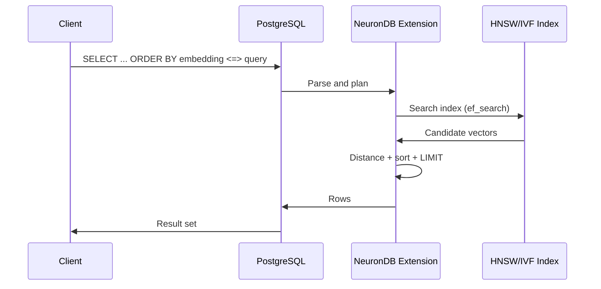
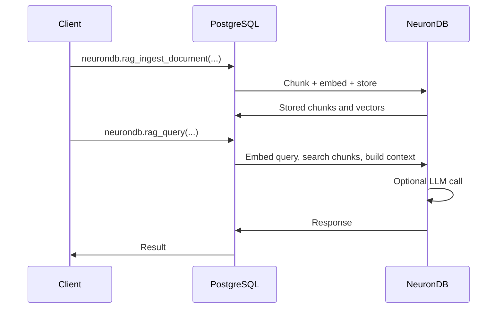

# Architecture Overview

How the NeuronDB PostgreSQL extension is structured and how it fits into PostgreSQL.

---

> [!TIP]
> For setup, see [Simple Start](simple-start.md).

---

## What is NeuronDB?

NeuronDB is a **PostgreSQL extension**. It adds AI and vector capabilities inside your database:

- **Vector search** — Similarity search using embeddings and indexes (HNSW, IVF)
- **Machine learning** — Train and run ML models in SQL (e.g. XGBoost, random forest)
- **Embeddings** — Generate vector representations of text and images
- **RAG** — Retrieval-augmented generation (ingest, retrieve, LLM integration)
- **Background workers** — Async jobs, index tuning, defragmentation

Everything runs inside the PostgreSQL process. No separate services are required for core functionality.

---

## Extension layout

| Layer | Role | Location |
|-------|------|----------|
| **SQL API** | Functions, operators, types exposed to SQL | `sql/neurondb--*.sql` |
| **Vector** | Vector types, distance ops, indexing | `src/vector/`, `src/index/` |
| **ML** | Training and inference (e.g. XGBoost, ONNX) | `src/ml/` |
| **Embeddings / LLM** | Embedding generation, LLM calls | `src/llm/`, embedding functions |
| **Workers** | neuranq, neuranmon, neurandefrag, neuranllm | Background worker processes |
| **GPU** | CUDA, ROCm, Metal backends | `src/gpu/` (optional build) |

Repository root contains `src/`, `sql/`, `Makefile`, and `build.sh`. There is no top-level `NeuronDB/` directory.

---

## Data flow: vector search

1. Client sends SQL (e.g. `ORDER BY embedding <=> $1 LIMIT 10`).
2. PostgreSQL hands the query to the NeuronDB extension.
3. NeuronDB uses the HNSW (or IVF) index to get candidates, then computes distances and returns the top rows.

---

## Data flow: RAG

Ingestion uses the extension’s document chunking and embedding functions. Query uses vector search for retrieval and optional LLM integration for the final answer.

---

## Key concepts

<strong>Why a PostgreSQL extension?</strong>

- **Single process** — No extra services for vector/ML; lower latency and simpler ops.
- **ACID** — Vector and relational data in the same transactions.
- **SQL** — One language for schema, vectors, and ML.
- **Portability** — Works with any PostgreSQL 16/17/18 deployment (native or managed).

<strong>Indexes</strong>

- **HNSW** — Default for approximate nearest neighbor; good recall/speed tradeoff.
- **IVF** — Alternative; can be faster on very large datasets with tuning.

Indexes are created with `CREATE INDEX ... USING hnsw (...)` (or `ivfflat`). See [Indexing](vector-search/indexing.md).

---

## Where to go next

| Topic | Document |
|-------|----------|
| **Setup** | [Simple Start](simple-start.md) |
| **First queries** | [Quick Start](quickstart.md) |
| **Troubleshooting** | [Troubleshooting](troubleshooting.md) |
| **Components** | [Components](../components/README.md) |
| **Index implementation** | [Index methods](../internals/index-methods.md) |

---

[Back to top](#architecture-overview) · [Documentation](../readme.md) · [Simple Start](simple-start.md)

